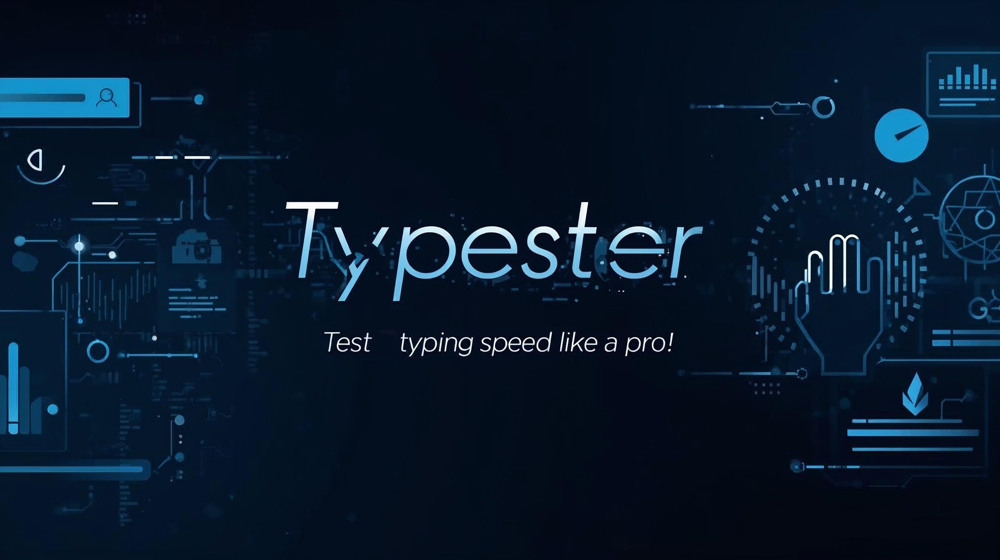

# Typester



Typester is a simple and elegant typing speed tester built using HTML, CSS, and JavaScript. It measures your words per minute (WPM), accuracy, and typing flow in real time.

---

## Features

- Real-time WPM and accuracy tracking  
- Interactive and minimal UI  
- Fully responsive design  
- Random text samples for each test  
- Works locally in any modern browser  

---

## Folder Structure

```
📦 Typester-main
 ┣ 📂assets
 ┃ ┗ 📂img
 ┃ ┃ ┗ 📜bg.png
 ┣ 📂test
 ┃ ┣ 📜index.html
 ┃ ┣ 📜styles.css
 ┃ ┗ 📜test.js
 ┣ 📜CNAME
 ┣ 📜index.html
 ┣ 📜main.js
 ┣ 📜README.md
 ┣ 📜styles.css
 ┗ 📜banner.jpg
```

---

## How to Run

1. Clone the repository  
   ```
   git clone https://github.com/Pranabsssssss/TypeTester.git
   ```
2. Open the project directory  
   ```
   cd TypeTester
   ```
3. Open `index.html` in your browser  

---

## Built With

- HTML5  
- CSS3  
- JavaScript (ES6)

---

## Future
